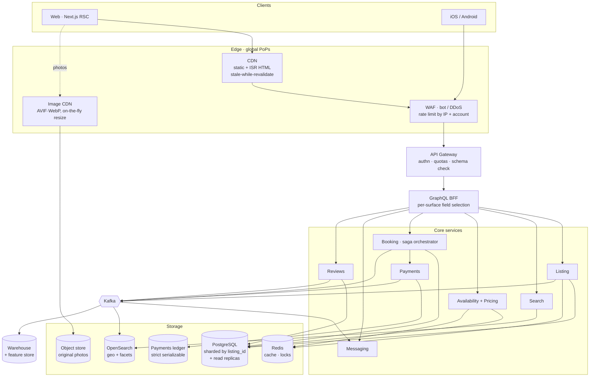

# Production Architecture — Vacation-Rental Marketplace

Scaling strategy for an Airbnb-scale marketplace: frontend, backend, storage,
search, and deployment. The clone in this repo is the "Listing page" leaf of
this tree; everything else is what it would take to serve it at scale.

---

## 1. Request path, edge to data

**Why this shape.** Reads outnumber writes by orders of magnitude, so the
listing page is served from cache at three layers (CDN HTML, Redis fragments,
Postgres replicas) and only the availability strip and price are computed
per-request. Writes are narrow and consistency-critical, so they go straight to
Postgres and fan out asynchronously through Kafka.

---

## 2. Frontend

| Concern | Approach |
|---|---|
| Rendering | Next.js App Router. Listing pages are **ISR** — statically generated, revalidated on write via an on-demand webhook from the Kafka consumer. Price/availability hydrate client-side so cached HTML never goes stale on money. |
| Server vs client | Server Components by default. Only the interactive leaves ship JS — the photo tour, lightbox, calendar, and carousel in this repo are the client boundary; every static section is server-rendered. |
| Images | Originals in object storage, served through an image CDN that negotiates AVIF/WebP and resizes per breakpoint. The hero mosaic requests exactly 560px and 272px variants — never a 4000px original scaled down in CSS. |
| Data | GraphQL BFF so web and mobile each fetch only the fields they render, avoiding the over-fetch that a shared REST resource forces. |
| Long tail | ~7M listings is far too many to prebuild. Prerender the top ~1% by traffic; the rest generate on first request and stay cached. |
| Perf budget | LCP is the hero image: `preload` on photo 0 only, everything else lazy. Fonts self-hosted as one variable woff2 (as here) to avoid a third-party connection on the critical path. |

## 3. Backend

Services are split by **failure domain and write pattern**, not by noun. Search
must degrade without taking down booking; payments must stay consistent when
search is down.

- **Booking is a saga**, not a distributed transaction: reserve inventory →
  authorize payment → confirm → notify, each step with a compensating action.
  A held reservation is a Redis lock with a TTL, so a crashed saga self-heals
  rather than stranding inventory.
- **Idempotency keys** on every mutating endpoint. Retries are guaranteed at
  this scale; double-charging is not acceptable.
- **The double-booking guard lives in the database**, not the app — an
  exclusion constraint on `(listing_id, date_range)`. Application-level checks
  lose to concurrency eventually; the constraint never does.
- Payments own an append-only ledger under strict serializability. Money is the
  one place to refuse eventual consistency.

## 4. Storage

| Store | Holds | Scaling |
|---|---|---|
| PostgreSQL | listings, bookings, users, reviews | Shard by `listing_id`; bookings co-located with their listing so the hot path is single-shard. Read replicas absorb page reads. |
| Ledger | payment events | Separate cluster, append-only, never sharded for convenience. |
| OpenSearch | search documents | Indexed by geohash + facets; replicas per region. |
| Redis | fragment cache, availability, reservation locks | Cluster mode; treated as disposable — a cold cache must be survivable. |
| Object store | photos, originals | Versioned, lifecycle-tiered to cold storage. |
| Warehouse | events for analytics + ML | Fed from Kafka, never queried by the serving path. |

**Consistency posture:** money and inventory are strongly consistent; search
rank, review counts, and recommendations are eventually consistent. A review
taking 30 seconds to appear is fine. A double booking is not.

## 5. Search

Geo-bounded, faceted, and personalized — the hardest read path.

1. **Retrieve** — OpenSearch narrows by map viewport (geohash), dates, guests,
   and hard filters. Availability is denormalized into the index as a bitmap
   per listing so date filtering happens in the engine, not in a post-filter.
2. **Rank** — a learned model reorders on relevance, quality, and predicted
   booking probability, reading from the feature store.
3. **Serve** — the result page is cached briefly by
   `(viewport, dates, guests, filters)`; personalization is applied as a
   re-rank on top so the expensive retrieval stays shareable.

Index freshness rides the same Kafka stream as everything else: a listing edit
is searchable in seconds without a batch reindex.

## 6. Deployment

- **Kubernetes**, multi-region active-active, traffic steered by latency.
  Stateless services scale on RPS and p99, not CPU.
- **Progressive delivery** — every change ships behind a flag: canary to 1%,
  watch error rate and p99, then ramp. Rollback is a flag flip, not a redeploy.
- **CI gates** mirror what this repo already enforces: typecheck, lint, unit,
  and a **visual-regression suite** — for a UI whose spec is "pixel-perfect",
  screenshot diffing is the only test that actually catches regressions.
- **Observability**: distributed tracing end to end, SLOs on the booking funnel
  rather than on CPU. The alert that matters is "bookings dropped 5%", not
  "a pod restarted".
- **Data migrations** run expand → backfill → contract, so a rollback never
  meets a schema it doesn't understand.

---

## 7. How this repo maps onto the diagram

| This repo | Production equivalent |
|---|---|
| `src/data/listing.ts` | Listing service response, cached at the BFF |
| `public/assets/images/*` | Object store behind the image CDN |
| ISR-ready static page | CDN-cached listing HTML |
| URL-driven overlay state | Deep-linkable, shareable, back-button-safe routes |
| `useDialog` focus/scroll contract | Shared design-system primitive |

The clone is deliberately a single static route with no backend: at one
listing, a database would be pure ceremony. The seam is `src/data/listing.ts` —
swapping it for a fetch against the Listing service is the only change the
components would need.
